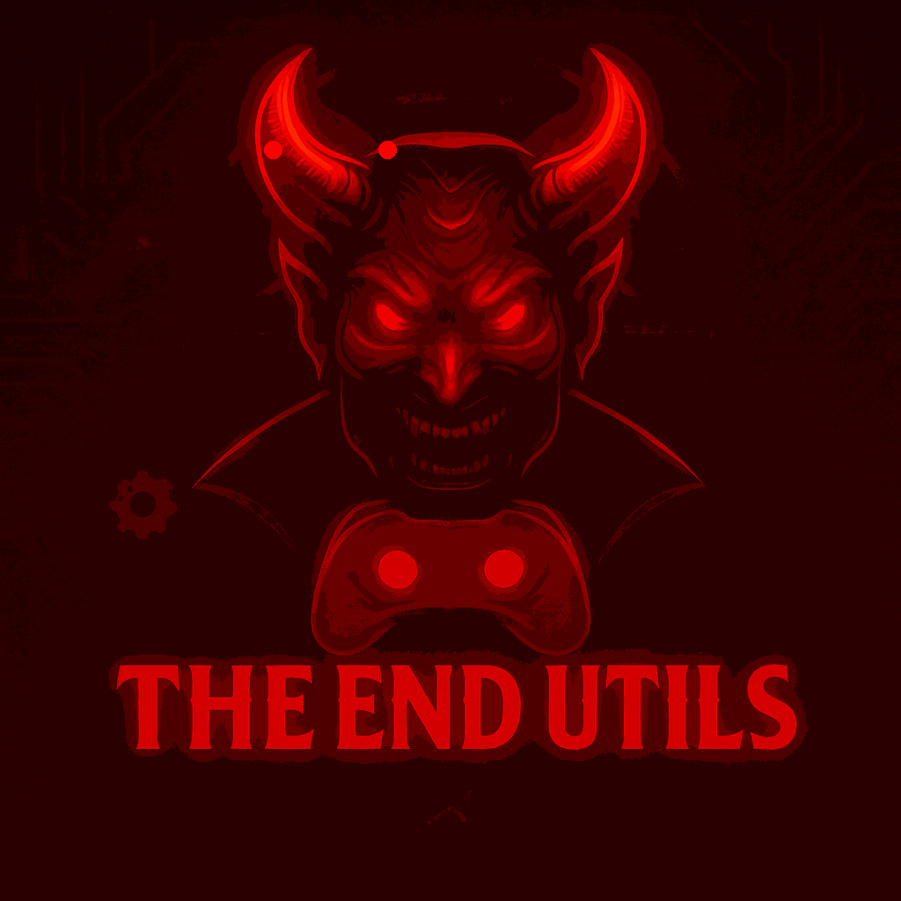

<h1 align="center">
  🔥 The End Utils 🤖
</h1>

<p align="center">
  
</p>

<p align="center">
  
</p>

<p align="center">
  
  
  
  
  
  
  
  
</p>

---

## 🕯️ Descripción Oscura

> Un bot diseñado en las entrañas del abismo digital para servir al dominio supremo de The End. Automatiza pruebas, castiga almas perdidas y mantiene el orden en tu imperio infernal.

---

## ⚙️ Características Inferno

- 🩸 Sistema de pruebas con alertas demoníacas
- 🔐 Control de roles y permisos oscuros
- 🪓 Comandos de administración punitiva
- 💤 Modo AFK espectral
- 📜 Reglas y plantillas preconfiguradas del inframundo
- ⛏️ Comandos Minecraft abismales

---

## 🔮 Comandos Detallados

### 🎭 Testing
_Comandos para pruebas y gestión de ingreso al clan._

- `??plantillas` — Muestra el formulario de solicitud para el clan.
- `??test @usuario` — Muestra el mensaje de finalización del test.
- `??pass <Nick> <@Discord> <Modo> <Resultado> <@Tester>` — Aprueba a un usuario, genera embed con skin y reacciones.
- `??nopass <Nick> <@Discord> <Modo> <Resultado> <@Tester>` — No aprueba a un usuario, genera embed con skin y reacciones.
- `??afk @usuario` — Marca a un usuario como AFK y notifica al staff después de 10 minutos.
- `??reglas` — Muestra las reglas del test de ingreso.

---

### 💀 Globales
_Comandos generales de interacción y diversión para todos los usuarios._

- `??kunno @usuario` — Kunnoniza la imagen de perfil de un usuario.
- `??kiss @usuario` — Envía un beso a un usuario.
- `??colombiano @usuario` o `??colombia @usuario` — Colombianiza la imagen de perfil de un usuario con gorra, gafas y polvo blanco.
- `??peru @usuario` — Peruaniza la imagen de perfil de un usuario.
- `??venezuela @usuario` o `??veneco @usuario` — Venezolaniza la imagen de perfil de un usuario con efecto esqueleto.
- `??hug @usuario` o `??abrazar @usuario` — Abraza a un usuario.
- `??slap @usuario` o `??bofetada @usuario` — Abofetea a un usuario.
- `??pat @usuario` o `??palmadita @usuario` — Da una palmadita a un usuario.
- `??baka @usuario` o `??tonto @usuario` — Llama tonto a un usuario.
- `??punch @usuario` o `??puñetazo @usuario` — Da un puñetazo a un usuario.
- `??blush @usuario` o `??sonrojarse @usuario` — Te sonrojas o haces sonrojar a alguien.
- `??cry @usuario` o `??llorar @usuario` — Llora o hace llorar a alguien.
- `??laugh @usuario` o `??reir @usuario` — Ríe o hace reír a alguien.
- `??poke @usuario` o `??tocar @usuario` — Toca a un usuario.
- `??cuddle @usuario` o `??acurrucar @usuario` — Acurruca a un usuario.
- `??wave @usuario` o `??saludar @usuario` — Saluda a un usuario.
- `??wink @usuario` o `??guiñar @usuario` — Guiña a un usuario.
- `??facepalm @usuario` o `??palmadacara @usuario` — Palmada en la cara (facepalm).
- `??dog` — Muestra una foto aleatoria de un perrito.
- `??cat` o `??gato` o `??gata` — Muestra una foto aleatoria de un gatito.
- `??random-user` o `??userrandom` o `??randomuser` — Muestra información de un usuario aleatorio.

---

### 🛠️ Utilidades
_Comandos útiles para todos los usuarios del servidor._

- `??avatar @usuario` — Muestra el avatar de un usuario en alta resolución.
- `??userinfo @usuario` — Muestra información detallada de un usuario.
- `??ayuda` — Muestra esta lista de comandos.
- `??redes` o `??fan` — Muestra las redes sociales.
- `??ontop` — Muestra el poderío de The End.
- `??infobot` — Muestra información sobre el bot.

---

### ℹ️ Info
_Comandos informativos sobre el bot y la comunidad._

- `??ontop` — Muestra el poderío de The End.
- `??infobot` — Muestra información sobre el bot.

---

### ⛏️ Minecraft
_Comandos útiles para jugadores de Minecraft en The End Community._

- `??tier <usuario_minecraft>` — Muestra las tiers de un jugador de Minecraft usando la API de McTiers.
- `??tierv2 <usuario_minecraft>` — Muestra las tiers v2 de un jugador de Minecraft usando la API de McTiers.io (Crystal, Elytra, etc).
- `??namehistory <usuario>` — Muestra el historial de nombres de un jugador de Minecraft usando la API de Crafty.gg.

---

### 🔞 NSFW
_Comandos solo disponibles en canales NSFW._

- `??waifu` — Descubre una waifu que te hará perder la cabeza.
- `??neko` — Una neko traviesa aparece solo para ti, ¿te atreves a mirarla?
- `??trap` — ¿Chico o chica? ¡Déjate sorprender por un trap irresistible!
- `??blowjob` — Alguien está disfrutando mucho... ¿quieres ver quién?
- `??anal` — Atrévete a explorar el lado más prohibido del placer.
- `??cum` — ¡Momento explosivo! Alguien no pudo contenerse...
- `??fuck` — La pasión se desborda y aquí nadie se contiene.
- `??pussylick` — Una lamida que hará temblar hasta al más valiente.
- `??solo` — Una chica se divierte a solas... ¿la acompañas con la mirada?
- `??solo_male` — Un chico se entrega al placer en solitario, sin vergüenza.
- `??threesome_fff` — Tres chicas, una fantasía y mucha acción.
- `??threesome_ffm` — Dos chicas y un chico, la mezcla perfecta para el caos.
- `??threesome_mmf` — Dos chicos y una chica, la fiesta está asegurada.
- `??yaoi` — Amor y pasión entre chicos, solo para corazones valientes.
- `??yuri` — Dulzura y deseo entre chicas, un momento para disfrutar.

---

### 🧠 Administración
_Comandos para la gestión y moderación del servidor. Solo para administradores._

- `??roles` — Muestra los roles permitidos para testing.
- `??roles add @rol` — Agrega un rol a la lista de roles permitidos.
- `??roles remove @rol` — Remueve un rol de la lista de roles permitidos.
- `??clear <cantidad>` — Borra hasta 50 mensajes en el canal actual.
- `??koth` — Envía o actualiza el embed de horarios de KOTH en el canal correspondiente.
- `??spam "frase" cantidad` — Envía una frase varias veces en el canal. Solo para admins. (máx 50 mensajes, máx 120 caracteres de frase)

---

## 🧾 Logs del Más Allá

Cada acción queda grabada en piedra infernal (<#1384905115617591380>).

---

## 🧪 Instalación del Ritual

```bash
git clone https://github.com/Rediaj04/TheEndUtils.git
cd TheEndUtils
npm install
```

Configura el `.env`:
```env
DISCORD_TOKEN=tu_token_aqui
```

Ejecuta el conjuro:
```bash
npm run dev
```

---

## 🐉 Requisitos del Grimorio

- Node.js v18+
- Discord Token
- Almas frescas y código limpio

---

## 🧩 Estructura

```bash
TheEndUtils/
├── src/
│   ├── commands/
│   ├── utils/
│   └── index.js
├── .env
├── package.json
└── README.md
```

---

## 🩷 Contribución de los Discípulos

```bash
git checkout -b feature/MaldicionNueva
git commit -m "Invoca: Maldición Nueva"
git push origin feature/MaldicionNueva
```

---

## 📜 Licencia

Bajo contrato infernal MIT.

---

## 🙏 Créditos y Agradecimientos

<p align="center">
  <br/><br/>
  
</p>
<p align="center"> Hecho con sangre y JavaScript por <a href="https://github.com/Rediaj04">Rediaj04</a> </p>

<p align="center">
  <b>Gracias a todos los proyectos y tecnologías que hacen posible The End Utils:</b><br><br>
  <a href="https://mctiers.com" title="McTiers API"></a>
  <a href="https://crafty.gg" title="Crafty.gg"></a>
  <a href="https://nodejs.org" title="Node.js"></a>
  <a href="https://discord.com" title="Discord"></a>
  <a href="https://discord.js.org" title="discord.js">
    
  </a>
  <a href="https://github.com/" title="GitHub"></a>
  <a href="https://www.npmjs.com/" title="NPM"></a>
  <a href="https://www.npmjs.com/package/canvas" title="Canvas">
    
  </a>
  <a href="https://www.npmjs.com/package/dotenv" title="dotenv"></a>
  <a href="https://nodemon.io/" title="nodemon">
    
  </a>
  <a href="https://developer.mozilla.org/es/docs/Web/JavaScript" title="JavaScript"></a>
</p>