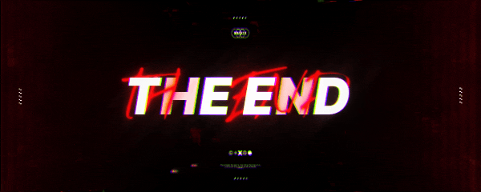

<h1 align="center">
  🔥 The End Utils 🤖
</h1>

<p align="center">
  
</p>

<p align="center">
  
</p>

<p align="center">
  
  
  
</p>

---

## 🕯️ Descripción Oscura

Un bot diseñado en las entrañas del abismo digital para servir al dominio supremo de The End. Automatiza pruebas, castiga almas perdidas y mantiene el orden en tu imperio infernal.

---

## ⚙️ Características Inferno

- 🩸 Sistema de pruebas con alertas demoníacas
- 🔐 Control de roles y permisos oscuros
- 🪓 Comandos de administración punitiva
- 💤 Modo AFK espectral
- 📜 Reglas y plantillas preconfiguradas del inframundo
- ⛏️ Comandos Minecraft abismales

---

## 🔮 Comandos Destacados

<details>
<summary>🎭 Testing</summary>

```bash
??plantillas        # Formulario de solicitud
??test @usuario     # Terminar prueba
??pass @usuario     # Aprobación demoníaca
??nopass @usuario   # Condena al olvido
??afk @usuario      # Marca como alma errante
??reglas            # Leyes del ingreso
```
</details>

<details>
<summary>💀 Globales</summary>

```bash
??kunno @usuario       # Kunnificación
??peru @usuario        # Efecto Perú
??veneco @usuario      # Efecto Venezuela esquelético
??kiss/hug/slap...     # Interacciones oscuras
??8ball                # Oráculo infernal
??ontop                # Dominio de The End
??infobot              # Datos secretos del bot
```
</details>

<details>
<summary>⛏️ Minecraft</summary>

```bash
??tier <usuario>    # Tiers abismales (McTiers.com)
??tierv2 <usuario>  # Tiers v2 (McTiers.io, Crystal/Elytra)
```
</details>

<details>
<summary>🔞 NSFW</summary>

```bash
??waifu / ??neko / ??trap / ??blowjob
(solo para los canales malditos)
```
</details>

<details>
<summary>🧠 Administración</summary>

```bash
??roles           # Gestión del poder
??clear <número>  # Exorcismo de mensajes
```
</details>

---

## 🧾 Logs del Más Allá
Cada acción queda grabada en piedra infernal (<#1384905115617591380>), con:

- 🧍 Usuario (ID)
- 🔮 Comando invocado
- 🕳️ Canal e ID
- ⏳ Fecha infernal

---

## 🧪 Instalación del Ritual

```bash
git clone https://github.com/Rediaj04/TheEndUtils.git
cd TheEndUtils
npm install
```

Crea tu grimorio `.env`:
```env
DISCORD_TOKEN=tu_token_aqui
```

Y ejecuta el conjuro:
```bash
npm run dev
```

---

## 🐉 Requisitos del Grimorio
- Node.js v18+
- Discord Token
- Almas frescas y código limpio

---

## 🧩 Estructura

```pgsql
TheEndUtils/
├── src/
│   ├── commands/
│   │   ├── admin/
│   │   ├── global/
│   │   ├── testing/
│   │   └── minecraft/
│   ├── utils/
│   └── index.js
├── .env
├── package.json
└── README.md
```

---

## 🩷 Contribución de los Discípulos

```bash
# Haz fork y comienza tu hechizo
git checkout -b feature/MaldicionNueva
git commit -m "Invoca: Maldición Nueva"
git push origin feature/MaldicionNueva
# Abre un portal (Pull Request)
```

---

## 📜 Licencia
Bajo el contrato infernal de la MIT. Consulta LICENSE.

---

## 🕯️ Créditos del Culto
<p align="center"> <br/><br/>  </p>
<p align="center"> Hecho con sangre y JavaScript por <a href="https://github.com/Rediaj04">Rediaj04</a> </p>

---

## 🙏 Agradecimientos y Créditos

<p align="center">
  <b>Gracias a todos los proyectos y tecnologías que hacen posible The End Utils:</b><br><br>
  <a href="https://mctiers.com" title="McTiers API"></a>
  <a href="https://crafty.gg" title="Crafty.gg"></a>
  <a href="https://nodejs.org" title="Node.js"></a>
  <a href="https://discord.js.org" title="discord.js"></a>
  <a href="https://github.com/" title="GitHub"></a>
</p>

- **McTiers API** ([mctiers.com](https://mctiers.com) y [mctiers.io](https://mctiers.io)) por proveer los datos de tiers de Minecraft.
- **Crafty.gg** ([crafty.gg](https://crafty.gg)) por el renderizado de skins 3D.
- **Node.js**, **discord.js** y **GitHub** por ser la base tecnológica del proyecto.
- Y a todas las APIs, librerías y herramientas open source que han hecho posible este bot. 